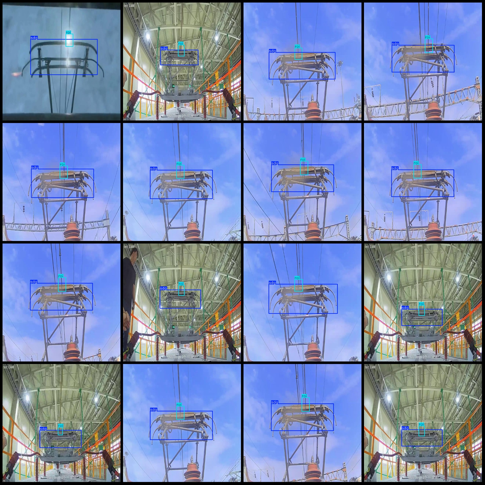

# High-Speed Rail Catenary Detection Dataset - VOC+YOLO Format (1245 Images, 2 Classes)

The dataset format: Pascal VOC format + YOLO format (without split path in the txt file, only containing jpg images along with their corresponding VOC and YOLO format txt files).
Number of images (jpg file count): 1245
Number of annotations (xml file count): 1245
Number of annotations (txt file count): 1245
Number of annotation categories: 2
Repository: firc-dataset
Annotation category names (note that the order of categories in the yolov2.yaml file does not match this, but refer to the labels folder's classes.txt for accuracy): ["roi", "sdg"]
Number of bounding boxes per class:
roi boxes = 1245
sdg boxes = 1245
Total bounding boxes = 2490
Image resolution: 640x640
Annotation tool used: labelImg
Annotation rules: draw rectangle bounding boxes for each category
Important notes: None
Special declarations: This dataset does not guarantee the accuracy of the trained models or weight files.
Image preview:
Annotation example:

## Images

Here is a pay link on Stripe ( https://buy.stripe.com/3cs8yP7sY87d0vu9AB ). Please contact me lonlonago@foxmail.com after funding $89, and I will send you a complete data files , thank you!

